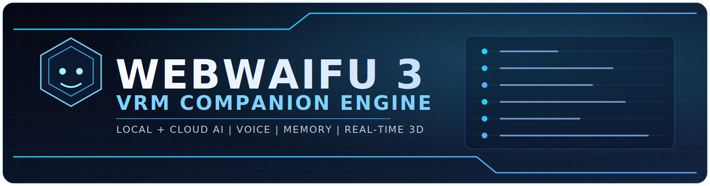

<div align="center">



# WEBWAIFU 3

### Browser-based VRM companion with local/cloud AI, voice, memory, and real-time 3D

<p>
  <a href="#quick-start">Quick Start</a> |
  <a href="#feature-surface">Features</a> |
  <a href="#provider-setup">Provider Setup</a> |
  <a href="#architecture">Architecture</a>
</p>

<p>
  
  
  
  
  
  
</p>

<p>
  
  
  
  
</p>

</div>

<h2 align="center" id="what-it-is">What It Is</h2>

WEBWAIFU 3 is a SvelteKit application that renders a VRM avatar and connects it to chat + voice AI pipelines in the browser.

Primary routes:

- `/` main companion UI
- `/manager` provider config, memory controls, voice management, and data tools

<h2 align="center" id="feature-surface">Feature Surface</h2>

### AI chat

- Providers: `ollama`, `lmstudio`, `openai`, `openrouter`
- Streaming token output wired into TTS enqueue flow
- Per-request Ollama tuning: `num_ctx`, `flash_attn`, `kv_cache_type`
- Character-based system prompts

### Text-to-speech

- Kokoro local TTS in a dedicated worker
- Fish Audio cloud TTS (streaming and non-streaming paths)
- Fish voice model operations from manager UI: list, search, create, delete

### Speech-to-text

- Whisper model: `Xenova/whisper-tiny.en`
- Worker-based transcription
- Push-to-talk with optional auto-send and mic permission pre-check

### Semantic memory

- Embeddings model: `Xenova/all-MiniLM-L6-v2` in worker
- Modes: `auto-prune`, `auto-summarize`, `hybrid`
- Similarity retrieval merges relevant history into prompt context
- Optional summarization LLM configuration

### 3D avatar and rendering

- VRM load from built-in asset or user upload
- Animation playlist/sequencer and crossfade controls
- Realistic material toggle (PBR path)
- Post-processing controls: bloom, chromatic aberration, film grain, glitch, FXAA/SMAA/TAA, bleach bypass, color correction, outline
- Adjustable key/fill/rim/hemi/ambient lighting
- Lip sync driven from active speech playback

### Persistence and management

- App settings saved in IndexedDB
- Provider defaults, visual settings, active tab, and conversation state persisted
- Conversation export (`JSON`, `TXT`)
- Data tools in manager: export all, import, clear history, factory reset
- Custom VRM binary persisted in IndexedDB
- Splash acceptance modal is shown on every load

<h2 align="center" id="quick-start">Quick Start</h2>

### Requirements

- Node.js (current LTS recommended)
- npm
- Modern browser with WebGL + WebAudio support
- At least one chat backend:
  - Local (`Ollama` or `LM Studio`)
  - Cloud (`OpenAI` or `OpenRouter`)

### Install and run

```bash
npm install
npm run dev
```

Dev URL: `https://localhost:5173`  
Note: HTTPS in development is provided by `@vitejs/plugin-basic-ssl`.

<h2 align="center" id="provider-setup">Provider Setup</h2>

### Ollama

1. Install Ollama and pull a model (example: `ollama pull llama3.2`).
2. Enable "Allow through network" in Ollama settings.
3. Set CORS origins so the browser can access Ollama.

Mac/Linux:

```bash
OLLAMA_ORIGINS=* ollama serve
```

Windows:

1. Add system environment variable `OLLAMA_ORIGINS=*`.
2. Restart Ollama.

### LM Studio

1. Download a model.
2. Start local server (default `http://localhost:1234`).
3. Enable CORS in LM Studio server settings.

### OpenAI / OpenRouter

1. Open `/manager`.
2. Add API key.
3. Select provider and model defaults.

### Fish Audio

1. Add Fish API key in `/manager`.
2. Fish requests are proxied through server routes:
   - `POST /api/tts/fish`
   - `POST /api/tts/fish-stream`

<h2 align="center" id="model-and-runtime-notes">Model and Runtime Notes</h2>

On first use, browser-side model downloads may occur and be cached:

- Kokoro ONNX model (local TTS)
- Whisper tiny.en model (local STT, roughly 40 MB class)
- MiniLM-L6-v2 model (embeddings, roughly 23 MB class)

Exact download size and startup latency can vary by platform and upstream model packaging.

<h2 align="center" id="security">Security</h2>

- Keys are stored in browser IndexedDB.
- Keys are sent only to selected providers and required proxy endpoints.
- Fish TTS requires API key transit through your deployed SvelteKit server route.
- Use scoped keys and provider spending limits for production.

<h2 align="center" id="scripts">Scripts</h2>

```bash
npm run dev
npm run build
npm run preview
npm run check
```

<h2 align="center" id="architecture">Architecture</h2>

- Frontend: SvelteKit 2, Svelte 5, TypeScript
- 3D: `three`, `@pixiv/three-vrm`
- LLM: `ai`, `@ai-sdk/openai`, `@ai-sdk/open-responses`
- STT/Memory models: `@huggingface/transformers` in web workers
- TTS: `kokoro-js` (local), `fish-audio` (cloud)
- Persistence: IndexedDB via `src/lib/storage/index.ts`

<h2 align="center" id="deployment">Deployment</h2>

Current project config uses `@sveltejs/adapter-vercel` (`svelte.config.js`).

If you deploy to a different target, switch adapters and ensure the Fish API routes are deployed server-side.

<h2 align="center" id="project-notes">Project Notes</h2>

- UI branding is `WEBWAIFU 3`.
- Some storage internals still use legacy naming for migration compatibility.

<h2 align="center" id="license">License</h2>

This repository currently does not include a `LICENSE` file. Add one before public distribution.

